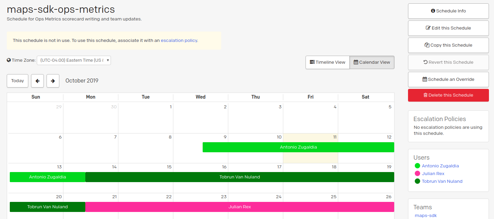
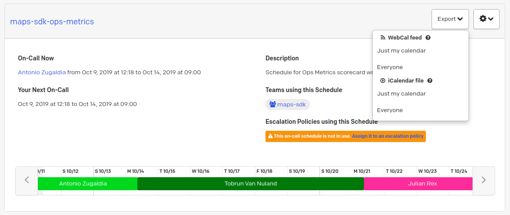
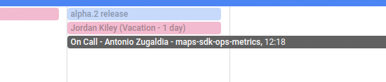

# Maps SDK Rotations on PagerDuty

The Maps SDK team shares a number of rotating responsibilities. In the past, we used ad-hoc mechanisms to track who's responsible for each rotation: Paper docs, spreadsheets, Slack reminders, you name it. This led to inconsistencies across responsibilities and little visibility into who was in charge of what each week.

We're now using PagerDuty to manage all out team rotations. This brings a few advantages:

- Centralized place to manage all rotations, current and future.
- Integration with Google Calendar and Slack (via [`on-call`](https://github.com/mapbox/on-call)).

## Does this mean that I need to be available 24/7 when I'm on call?

No. With the exception of the `maps-sdk-on-call` schedule (more on this below), these schedules are considered “low urgency” and do not have an escalation policy attached to them. We're just using PagerDuty to manage our shared calendar.

## Why don't we simply use Google Calendar instead?

Google Calendar does not integrate with Slack, with the `on-call` bot, and doesn't have a clear mechanism to handle team vacation. PagerDuty instead has these features and does integrate with Google Calendar. We get the best of both worlds.

## How do I access PagerDuty?

You login via Okta. If you don't see PagerDuty in your Okta account, request it to be added by opening a `/help` ticket.

## Which rotations are managed through PagerDuty?

These are all the schedules we currently have ([list available on PagerDuty](https://mapbox.pagerduty.com/schedules)):

- `maps-sdk-on-call` — **this is the only schedule with an escalation policy attached**. Members of this rotation need to be ready to respond in the event of an emergency or critical issue with our service. You can [read more about it here](https://github.com/mapbox/ops-metrics-review/issues/71).
- `maps-sdk-ops-metrics` — in charge of presenting at Ops Metrics Review this week.
- `maps-sdk-customer-review` — in charge of investigating customer-related metrics and facilitate the weekly Mobile Maps SDK Review.
- `maps-sdk-ios-release-carbon` and `maps-sdk-android-release-carbon` — in charge of releases for the Maps SDK Carbon. Release branches are named with city names. If no releases are scheduled that week, you should be ready to answer any release-related questions and to issue any unplanned patch releases.
- `maps-sdk-ios-release-hydrogen` and `maps-sdk-android-release-hydrogen` — Same as above, except for the Maps SDK Hydrogen, whose release branches are named with drink names.
- `maps-sdk-ios-qa` and `maps-sdk-android-qa` — in charge of running QA exercises for both Maps SDK Carbon and Hydrogen. You should target any releases being published this week. If no releases are issued this week, you should target the previous release, and you should use a different device than the previous QA exercise for that release.

## Who do I know who is on call for a specific rotation?

There are a few ways to do this:

- We recommend that you integrate the rotation calendar with your Google Calendar. To do so, visit a specific schedule on PagerDuty and click the “Export” button. You can subscribe to everyone's rotations information, or just yours.
- Alternatively, you can check the schedule directly on PagerDuty.
- 🔜 Coming soon to Slack (see question below).

## Can we get handoff notifications on Slack too?

Yes, [this is possible](https://github.com/mapbox/on-call#how-do-i-set-urgency-levels-on-alarms) but it's blocked by https://github.com/mapbox/on-call/pull/164.

## I'm going on vacation, how do I update my schedules to avoid being on call while I'm off?

You need to set up an override and swap your rotation with someone else. This person will take over either a portion of or your entire on-call shift. This is useful for planned vacations, unplanned illnesses, or other life events. You can read more about how to [set up an override here](https://support.pagerduty.com/docs/editing-schedules#section-create-and-delete-overrides).

## There's a new thing we need to set up a rotation for. Should I use PagerDuty?

Yes. Ping the team if you have any questions or if you hit any limitations.

